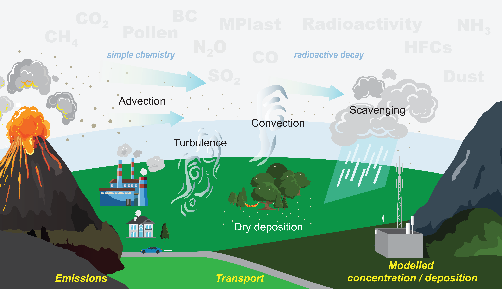

# Welcome to the FLEXPART 11 documentation

<figure>
	
	<figcaption>Credit: Christine Forsetlund Solbakken (<a href="https://www.colourbox.com/">https://www.colourbox.com/</a>) and Sabine Eckhardt (NILU).</figcaption>
</figure>

- [**Building**](building.md): Information on how to download and install FLEXPART.
	- [Download FLEXPART](building.md#download)
	- [Compiling FLEXPART](building.md#compiling)
- [**Configuration**](configuration.md#config): How to set up a simulation, with an explanation of all input files.
	- [Option files](configuration.md#options)
	- [Pathnames file](configuration.md#pathnames)
	- [AVAILABLE file](configuration.md#available)
	- [User-defined initial conditions](configuration.md#ic)
	- [Restarting a simulation](configuration.md#restart)
- [**Linear Chemistry Module**](LCM.md): A description of how to configure the Linear Chemistry Module.
- [**Running**](running.md): A description of how to run FLEXPART after building and configuration.  
- [**Output files**](output.md): A list of all possible output options and files.
- [**Particle transport**](transport.md): An overview of all processes relation to the direct transport of particles.  
- [**Evolution of particle properties**](evolution.md): An overview of internal particle processes.
- [**Examples**](examples.md): FLEXPART studies and example cases.  
- [**Containers**](containers.md): Available containers.
- [**Trouble Shooting**](troubleshooting.md): A list of common problems.  

This manual covers FLEXPART 11 ([Bakels et al. 2024](https://egusphere.copernicus.org/preprints/2024/egusphere-2024-1713/)).
Although this manual might proof useful for earlier versions as well, please refer and cite the correct documentation when using an older version:

- [FLEXPART 10.4](https://gmd.copernicus.org/articles/12/4955/2019/)
- [FLEXPART 9](https://www.flexpart.eu/export/87d96843f7f85bb599c0f7cdfb7f1f42731b9eaf/flexpart.git/doc/latex-manual/flexpart9.3.pdf)
- [FLEXPART 8](https://www.flexpart.eu/export/43c86848adb64a2282787e3e7edec499b823078a/flexpart.git/documentation/flexpart8.pdf)
- [FLEXPART 6.2](https://acp.copernicus.org/articles/5/2461/2005/)
- [FLEXPART 3.1](https://folk.nilu.no/~andreas/flexpart/flexpart61.pdf)
- [FLEXPART 1](https://www.sciencedirect.com/science/article/pii/S1352231098001848)

