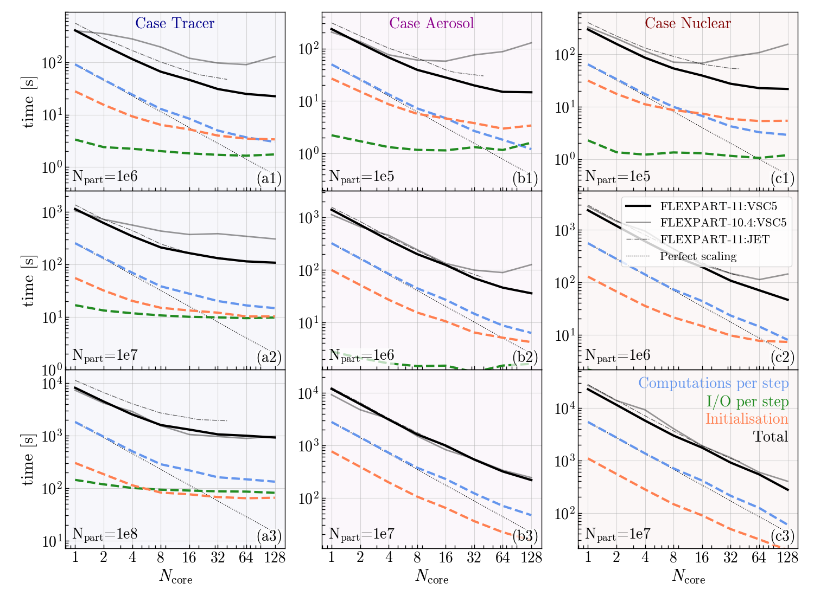

# Running

<span style="color:red">
**WARNING:**
</span>
For many systems it is required to print the following in the command line or to set it in your submit script before executing FLEXPART compiled with OpenMP:
~~~
ulimit -s unlimited
~~~
Not setting this can result in a segmentation fault close to the start of your simulation.

Additionaly, one should set the following for optimal memory usage:
~~~
export OMP_PLACES=cores
export OMP_PROC_BIND=true
~~~
Not setting these can result in unnecessary slow performance of your application.

## Command line usage

FLEXPART accepts two command line options:

- `pathnames`, setting all appropriate paths, as explained in [Configuration](configuration.md#config).
- `-v <verbosity>`, currently not operational

## Exit code

The introduction of `error stop` in Fortran 2008 now guarantees FLEXPART to only exit with code `0` for successful runs. Any other exit code indicates a failed run.

## Input data
FLEXPART advances particles based on interpolated meteorological fields, namely grid-scale three-dimensional fields of wind velocities, density, temperature, specific humidity, cloud liquid water and ice content, as well as precipitation and various surface fields. In principle, any gridded data set could be used. Data formats and coordinate systems used as well as differences in the meteorological variables provided, however, would make a generic input interface rather complex. The main FLEXPART code described here supports two input formats, data from ECMWF's and from NCEP's forecast systems (IFS and GFS, respectively). For ECMWF data, the [flex_extract](https://flexpart.img.univie.ac.at/flexextract/index.html) software package ([Tipka et al. 2020](https://gmd.copernicus.org/articles/13/5277/2020/)) is provided to extract, process, and store the required fields for use as FLEXPART input, including support for ECMWF's reanalyses.

In addition, to run FLEXPART, there are three important (sets) of files that need to be specified.
These are:

- the [**option files**](configuration.md#options), defining the set-up of the run,
- the [**pathnames file**](configuration.md#pathnames), defining the paths of where input and output are located, 
- the [**AVAILABLE file**](configuration.md#available), listing all available [meteorological input files](running.md#meteodata).

A full description of these files can be found in [Configuration](configuration.md#config).


### <a name="meteodata"></a>Meteorological input data

Necessary fields from Eularian models:

| Input field | Description | Unit|
| ------------- | ----------- | --------- |
**3D fields**
|horizontal velocities  |Grid scale velocities used for, e.g., particle propagation  | m/s |
|vertical velocity      |Vertical velocities on model levels used for, e.g., particle propagation. | Pa/s (IFS, flex_extract), m/s (GFS)|
|Temperature            |Air temperature used in convection, chemical loss, relative humidity, and vertical transformation calculation | K |
|Specific (IFS) or relative (GFS) humidity |Internal use of specific humidity for convection, relative humidity, vertical transformation, and dry air density calculation | kg/kg (IFS), % (GFS) |
**2D fields**
|Surface pressure |Pressure at the ground level. | Pa |
|Snow depth |Thickness of snow layer necessary for dry deposition calculation. | m |
|Cloud cover |Fraction of the grid cell that is covered by cloud, used for wet deposition calculations. | 0-1 |
|10 meter horizontal velocities |Used to compute surface stress if not available. | m/s |
|2 meter temperature |Used to calculate friction velocity, obukhov length, convection, and vertical transformation | K |
|2 meter dew point (ECMWF only) |Used to calculate friction velocity, obukhov length, convection, and vertical transformation, for GFS, this is computed according to [Bolton 1980](https://doi.org/10.1175/1520-0493(1980)108%3C1046:TCOEPT%3E2.0.CO;2). | K |
|Large scale precipitation |Used in the wet deposition scheme. | mm/h |
|Convective precipitation |Used in the wet deposition scheme. | mm/h |
|Sensible heat flux (ECMWF only)  | Used to compute Obukhov length, for GFS this is computed using the profile method ([Berkowicz & Prahm 1982](https://doi.org/10.1016/0004-6981(82)90032-4)). | J m^2 |
|Solar radiation (ECMWF only) |Used to calculate the surface resistance for gases, for GFS solar radiation is assumed to be zero. | J m^2 |
E-ward N-ward turbulent surface stress (ECMWF only)  |Surface stress used for dry deposition computations. For GFS data, surface stress is calculated using [Berkowicz & Prahm 1982](https://doi.org/10.1016/0004-6981(82)90032-4). | N m^2 s |
|Orography |Altitude of topography above sea level | m |
|Standard deviation of orography |Included into mixing layer height to account for subgrid scale variability | m |
|Land sea mask |Invoking surface stress computation including wind speeds over sea | 0-1 |
|Cloud liquid water content |Used by the wet scavenging scheme | kg/kg |
|Cloud ice water content |Used by the wet scavenging scheme | kg/kg |

<br/>

## OpenMP

Where most of FLEXPART's computational time is spent is very dependent on the specific problem to be solved and the set-up of FLEXPART. For example, when many particles are released from a single release point, initially most time is spent on particle trajectory computations. However, when a global high-resolution domain for the meteorological input data is used, significant time is spent on the convection computations on the grid. On the other hand, when few particles are used, computations on the gridded meteorological input data (e.g., coordinate transformations) are taking a large share. For this reason, we implemented OpenMP parallelisation throughout FLEXPART and tried to avoid bottlenecks at least for the most common set-ups.

We parallelised all particle based computations, apart from their initial release in the `releaseparticles` subroutine. On top of that, we parallelised the reading and computations on the meteorological fields, including the convection, wet and dry deposition, and the vertical coordinate transformation of the fields. Lastly, we parallelised the computations needed for the output, both for the gridded output and the particle dump.

One drawback of OpenMP parallelisation is that it is more difficult for users to make changes than in serial code, since they also are likely to have to update OpenMP regions. To minimise errors, we therefore strongly recommend users to make changes in the form of subroutines and functions and avoid the use of global variables.

We advise users to test their application using different number of threads in order to find the optimal set-up. The figure below (from [Bakels et al. 2024](https://egusphere.copernicus.org/preprints/2024/egusphere-2024-1713/)) serves as a guideline for deciding how many threads one should use given the three examples laid out in [Example cases](examples.md#cases).
<figure>
	
	<figcaption>Demonstration of the strong scalability of the OpenMP parallelisation of FLEXPART 11. Shown is the computation time as a function of the number of cores used. Perfect strong scalability is represented by the slope of the straight dotted thin black lines. The left column of panels, shaded in blue, show results for globally distributed passive tracer particles. The middle column, shaded in magenta, shows results for globally distributed aerosols. The right column, shaded in maroon, shows results for xenon-133 emitted from a single point source. In black, the total computational time of a 5 hour run is plotted for FLEXPART 11 (solid black lines). The MPI parallelised FLEXPART 10.4 equivalent is plotted for reference (solid grey lines). The coloured dashed lines represent the break-down of computational time spent in different components of FLEXPART 11: the blue lines represent the total computational time per hourly time-steps minus the I/O operations (green lines), and initialisation of the run (orange lines). Note that the black lines are not the sum of all other lines, since the black lines show the total time the simulation took, while both the I/O operations and computations are shown per hour of simulation time.</figcaption>
</figure>

## HPC systems

### SLURM example script

```
#!/bin/bash
#SBATCH --job-name=example
#SBATCH --output=example.log
#SBATCH --nodes=1 --ntasks-per-node=10 --ntasks-per-core=2 
#SBATCH --mem=30GB 
#SBATCH --time=20:00:00

export OMP_NUM_THREADS=10
export OMP_PLACES=cores
export OMP_PROC_BIND=true
ulimit -s unlimited

./FLEXPART_ETA pathnames
```