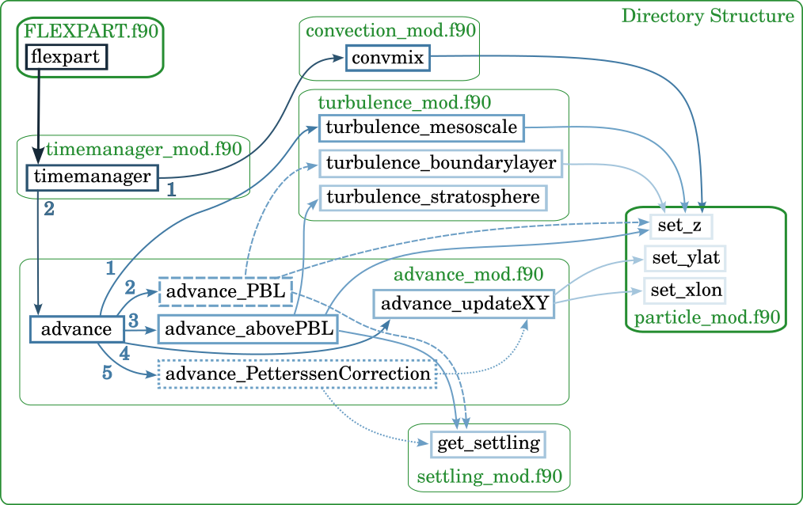

# Particle transport

<figure>
	
	<figcaption>Simplified call tree for the transport of particles; green boxes represent modules containing subroutines (blue boxes) responsible for updating the location of particles through time.</figcaption>
</figure>
(From [Bakels et al. 2024](https://egusphere.copernicus.org/preprints/2024/egusphere-2024-1713/))

## Turbulence
FLEXPART offers the option to choose between Gaussian and skewed turbulence. Gaussian turbulence is in principle only valid for stable and neutral conditions and not for convective conditions. For convective conditions, the error is minor for transport distances where particles get mixed through the planetary boundary layer. For applications where the well-mixed criterion is violated (e.g. for inverse modelling of point source emissions from near field measurements), the user can choose to set the switch [CBL](running.md#CBL) to 1 in the [COMMAND](running.md#command) file, switching on the skewed turbulence scheme developed by [Cassiani et al. 2015](https://link.springer.com/article/10.1007/s10546-014-9976-5). Recommended is to only use this option when necessary, because of the increased computational cost. A detailed description of the skewed turbulence scheme can be found in [Cassiani et al. 2015](https://link.springer.com/article/10.1007/s10546-014-9976-5).

### PBL
Turbulence in the planetary boundary layer is parameterised assuming a Markov chain based on the Langevin equation ([Thomson 1987](https://www.cambridge.org/core/journals/journal-of-fluid-mechanics/article/abs/criteria-for-the-selection-of-stochastic-models-of-particle-trajectories-in-turbulent-flows/3175551812282ED52EE96C23E37EBBDE)).
The three dimensional Lagrangian time scales and turbulent energy parameters for Gaussian turbulence are computed following the scheme described by Hanna and Chaughey or by [Ryall & Maryon 1998](https://www.sciencedirect.com/science/article/abs/pii/S1352231098001770) for neutral ($h$PBL/$l$obukhov$<1$), stable ($l$obukhov$<0$), and unstable conditions. This parameterisation uses the convective scale velocity, height of the PBL, Obukhov length, roughness length, friction velocity and vertical position of each particle. FLEXPART switches between these two schemes according to if adaptive time steps are use ([CTL](running.md#CTL) in [COMMAND](running.md#command)).

### Mesoscale
This is optional and can be set in the COMMAND file. It follows the method as described by [Maryon 1998](https://www.sciencedirect.com/science/article/abs/pii/S1352231097003257).

### Turbulence in the troposphere and stratosphere
Turbulent velocities above the PBL, both in the stratosphere and in the troposphere are computed following [Legras et al. 2003](https://agupubs.onlinelibrary.wiley.com/doi/full/10.1029/2002JD003045), using a constant vertical diffusivity ($D_z = 0.1$ m2 s-1) to compute vertical turbulent velocities in the stratosphere, and a constant horizontal diffusivity ($D_h = 50$ m2 s-1)  to compute horizontal turbulent velocities in the free troposphere. Velocity scales are then obtained by using $\sigma_{v_i}=\sqrt{D_i/dt}$. A linear transition height of 1 km is used between the troposphere and stratosphere.

## Convection

Convective transport is parameterised by using the scheme described by [Emanuel & Zivkovic-Rothman](https://journals.ametsoc.org/view/journals/atsc/56/11/1520-0469_1999_056_1766_daeoac_2.0.co_2.xml).

In FLEXPART 11, all convection related computations are located in the convection module (**conv\_mod.f90**), including subroutines that are solely used by the convection subroutines. These include the convective mixing (\texttt{calcmatrix}), the computation of the matrix that describes convective redistribution of mass in a grid column (`calcmatrix`), according to the convection scheme described in [Emanuel & Zivkovic-Rothman](https://journals.ametsoc.org/view/journals/atsc/56/11/1520-0469_1999_056_1766_daeoac_2.0.co_2.xml) (`convect` and `tlift`), the convective mixing of particles (`convmix`), and the redistribution of particles because of convection (`redist`). 

The sorting algorithm used in `convmix` has been updated with a modified sorting module from [The Fortran Standard Library](https://fortran-lang.org/), who cite [Musser 1999](https://onlinelibrary.wiley.com/doi/abs/10.1002/(SICI)1097-024X(199708)27:8%3C983::AID-SPE117%3E3.0.CO;2-%23) as the source for their algorithm. This new sorting algorithm is an order of 4 magnitudes faster and is located in a separate module, **sort\_mod.f90**. In addition, most loops in the `convect` subroutine have been replaced with array operations.

## Settling

Gravitational settling of particles is computed at each time step and included in the vertical velocities. These are computed following [Naslund & Thaning 2007](https://www.tandfonline.com/doi/abs/10.1080/02786829108959487), with a temperature dependent dynamic viscosity that is computed using the formula of [Sutherland 1893](https://www.tandfonline.com/doi/abs/10.1080/14786449308620508?journalCode=tphm16).

### Shape factor
In FLEXPART 11, the computation of settling velocities is done in the settling module, **settling\_mod.f90**. Where the previous versions of FLEXPART did not consider other shapes of aerosols other than spheres, now the settling velocity can also be computed for non-spherical particles as described in detail in [Tatsii et al. 2023](https://pubs.acs.org/doi/10.1021/acs.est.3c08209).

